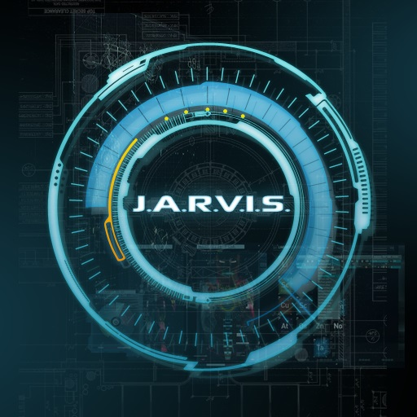

*Work in Progress once again. Added many more voice commands soon!


[![Contributors][contributors-shield]][contributors-url]
[![Forks][forks-shield]][forks-url]
[![Stargazers][stars-shield]][stars-url]
[![Issues][issues-shield]][issues-url]
[![MIT License][license-shield]][license-url]
[![LinkedIn][linkedin-shield]][linkedin-url]


<!-- PROJECT LOGO -->
<p align="center">
  <a href="https://github.com/Dantusaikamal/Desktop-Assistant">
    
  </a>
</p>

  # Desktop Assistant using Python


    J.A.R.V.I.S is a python desktop assistant that is capable of carrying many day to day tasks using voice command. It can perform many activities such as opening and send mails, opening desktop applications, playing music, etc!
  
  


<!-- TABLE OF CONTENTS -->
## Table of Contents

* [About the Project](#about-the-project)
  * [Built With](#built-with)
* [Getting Started](#getting-started)
  * [Prerequisites](#prerequisites)
  * [Installation](#installation)
* [Usage](#usage)
* [Roadmap](#roadmap)
* [Contributing](#contributing)
* [License](#license)
* [Contact](#contact)
* [Acknowledgements](#acknowledgements)


<!-- ABOUT THE PROJECT -->
## About The Project


I've created a desktop assistant and named it J.A.R.V.I.S which makes our day to day task much easier. It is capable of doing various tasks and I'll be adding more functions soon :)

** List of commands:**


1. wikipedia + 'query':

```
Say wikipedia and wait for a second. Now say what you want J.A.R.V.I.S to search in Wikipedia.
```

2. Open YouTube

```
This command will open YouTube from your default browser
```

3. Open Gmail

```
This command will open Gmail from your default browser
```

4. Open Google + 'query'

```
Say Google and wait for a second. Now say what you want J.A.R.V.I.S to search in Google.
```

5. The Time

```
Says out current time in your system
```

6. Send mail to 'user'
```
Define who you want to send in the code in the send mail section first.
Say mail to 'user' and wait for a second.
Say the content of the mail
```
7. Open desktop applications (VS Code, Spotify, etc!)
```
Open which ever desktop application you want by specifying the app's name in the code and it's complete path. Check out Open Code and Open Spotify commands for more information on how to open desktop applications
```
8. J.A.R.V.I.S sleep
```
When you no longer want J.A.R.V.I.S to answer you, simply say Jarvis sleep.
```

These are the commands for J.A.R.V.I.S in the initial version. More and more commands will be added soon!

### Built With

* [Python](Python)


<!-- GETTING STARTED -->
## Getting Started

To get a local copy up and running follow these simple steps.

### Prerequisites

This is an example of how to list things you need to use the software and how to install them.

* pip
```sh
pip install requirements.txt
```

### Installation

1. Clone the repo
```sh
git clone https://github.com/dantusaikamal/Desktop-Assistant.git
```
2. Install Python dependencies
```sh
pip install package_name
```


<!-- ROADMAP -->
## Roadmap

See the [open issues](https://github.com/Dantusaikamal/Desktop-Assistant//issues) for a list of proposed features (and known issues).


<!-- CONTRIBUTING -->
## Contributing

Contributions are what make the open source community such an amazing place to be learn, inspire, and create. Any contributions you make are **greatly appreciated**.

1. Fork the Project
2. Create your Feature Branch (`git checkout -b feature/AmazingFeature`)
3. Commit your Changes (`git commit -m 'Add some AmazingFeature'`)
4. Push to the Branch (`git push origin feature/AmazingFeature`)
5. Open a Pull Request


<!-- LICENSE -->
## License

Distributed under the MIT License. See `LICENSE` for more information.


<!-- CONTACT -->
## Contact

Dantu Sai Kamal - [@saikamaldantu](https://twitter.com/saikamaldantu) - dantusaikamal@gmail.com

Project Link: [https://github.com/Dantusaikamal/Desktop-Assistant/](https://github.com/Dantusaikamal/Desktop-Assistant/)


<!-- MARKDOWN LINKS & IMAGES -->
<!-- https://www.markdownguide.org/basic-syntax/#reference-style-links -->
[contributors-shield]: https://img.shields.io/github/contributors/dantusaikamal/Desktop-Assistant.svg?style=flat-square
[contributors-url]: https://github.com/Dantusaikamal/Desktop-Assistant/graphs/contributors
[forks-shield]: https://img.shields.io/github/forks/dantusaikamal/Desktop-Assistant.svg?style=flat-square
[forks-url]: https://github.com/Dantusaikamal/Desktop-Assistant/network/members
[stars-shield]: https://img.shields.io/github/stars/dantusaikamal/Desktop-Assistant.svg?style=flat-square
[stars-url]: https://github.com/Dantusaikamal/Desktop-Assistant/stargazers
[issues-shield]: https://img.shields.io/github/issues/dantusaikamal/Desktop-Assistant.svg?style=flat-square
[issues-url]: https://github.com/Dantusaikamal/Desktop-Assistant/issues
[license-shield]: https://img.shields.io/github/license/dantusaikamal/Desktop-Assistant.svg?style=flat-square
[license-url]:https://github.com/Dantusaikamal/Desktop-Assistant/blob/master/LICENSE
[linkedin-shield]: https://img.shields.io/badge/-LinkedIn-black.svg?style=flat-square&logo=linkedin&colorB=555
[linkedin-url]: https://linkedin.com/in/Dantu-Sai-Kamal
[product-screenshot]: Images/J.A.R.V.I.S.jpg
